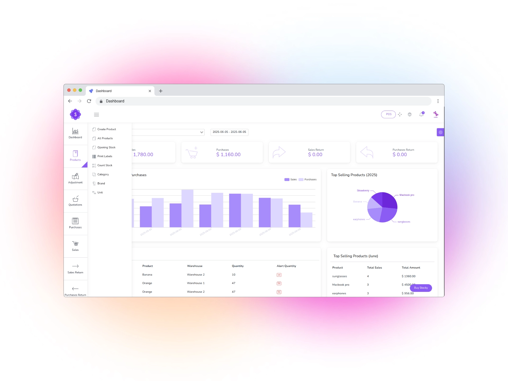

# POS Management and Inventory System

A complete Point of Sale (POS) and Inventory Management System built with Laravel 8.



## Server Requirements

-   PHP >= 7.3.0
-   MySQL 5.x or higher
-   BCMath PHP Extension
-   Ctype PHP Extension
-   Fileinfo PHP Extension
-   GD2 PHP Extension
-   JSON PHP Extension
-   Mbstring PHP Extension
-   OpenSSL PHP Extension
-   PDO PHP Extension
-   Tokenizer PHP Extension
-   XML PHP Extension

## Installation Steps

### 1. Clone the Repository

```bash
git clone [repository-url]
cd [project-directory]
```

### 2. Install Dependencies

```bash
composer install
npm install
```

### 3. Environment Setup

```bash
cp .env.example .env
php artisan key:generate
```

### 4. Configure Database

Edit the `.env` file and set your database credentials:

```
DB_CONNECTION=mysql
DB_HOST=127.0.0.1
DB_PORT=3306
DB_DATABASE=your_database_name
DB_USERNAME=your_database_username
DB_PASSWORD=your_database_password
```

### 5. Run Migrations and Seeders

```bash
php artisan migrate --seed
```

### 6. Create Storage Link

```bash
php artisan storage:link
```

### 7. Compile Assets

```bash
npm run dev
```

### 8. Set Permissions

```bash
chmod -R 775 storage bootstrap/cache
chown -R www-data:www-data storage bootstrap/cache
```

### 9. Configure Web Server

#### For Apache:

Create a virtual host configuration:

```apache
<VirtualHost pos.local:80>
    ServerAdmin webmaster@pos.local
    DocumentRoot "/path/to/your/project/public"
    ServerName www.pos.local
    ServerAlias pos.local

    <Directory "/path/to/your/project/public">
        Options Indexes FollowSymLinks Includes ExecCGI
        AllowOverride All
        Require all granted
    </Directory>

    ErrorLog "logs/pos.local-error.log"
    CustomLog "logs/pos.local-access.log" common
</VirtualHost>
```

**Note:** After creating the virtual host configuration:

1. Add the following line to your hosts file (`/etc/hosts` on Linux/Mac or `C:\Windows\System32\drivers\etc\hosts` on Windows):

```
127.0.0.1 pos.local www.pos.local
```

2. Restart Apache server

#### For Nginx:

```nginx
server {
    listen 80;
    server_name your-domain.com;
    root /path/to/project/public;

    add_header X-Frame-Options "SAMEORIGIN";
    add_header X-Content-Type-Options "nosniff";

    index index.php;

    charset utf-8;

    location / {
        try_files $uri $uri/ /index.php?$query_string;
    }

    location = /favicon.ico { access_log off; log_not_found off; }
    location = /robots.txt  { access_log off; log_not_found off; }

    error_page 404 /index.php;

    location ~ \.php$ {
        fastcgi_pass unix:/var/run/php/php7.4-fpm.sock;
        fastcgi_param SCRIPT_FILENAME $realpath_root$fastcgi_script_name;
        include fastcgi_params;
    }

    location ~ /\.(?!well-known).* {
        deny all;
    }
}
```

### 10. Default Login Credentials

After installation, you can log in with these default credentials:

-   Email: admin@example.com
-   Password: 123456

**Important:** Change these credentials immediately after first login.

## Features

-   Easy POS and Dynamic dashboard
-   Items, Adjustment, Transfer management
-   Quotations, Sales, Purchases tracking
-   Returns Customer & Supplier management
-   Users, Customers, Suppliers management
-   Currency, Units, Category management
-   Payment Sales & Purchases tracking
-   Payments Report generation
-   Overview & warehouse stock charts
-   Purchases & Sales reports
-   Customers & suppliers reports
-   Product quantity alerts
-   Mail notification system
-   Dark Version Included
-   Multilingual support (14 languages)
-   RTL Support
-   Pure Vue.js implementation
-   Clean and organized code structure

## Security Features

-   CSRF Protection
-   XSS Protection
-   SQL Injection Prevention
-   Prepared Statements
-   Secure Authentication
-   Role-based Access Control

## Support

For any issues or questions, please refer to the documentation or create an issue in the repository.

## License

This project is licensed under the MIT License.

## Source

https://www.campcodes.com/projects/php/complete-pos-management-and-inventory-system-in-php-mysql/
